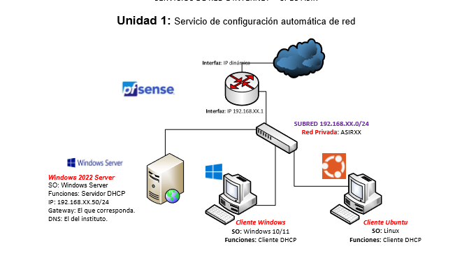
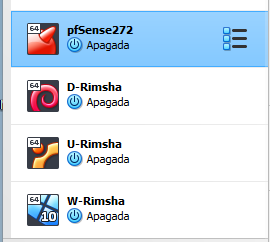
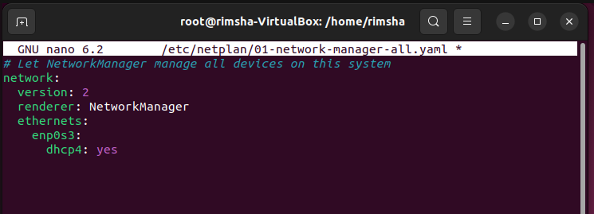
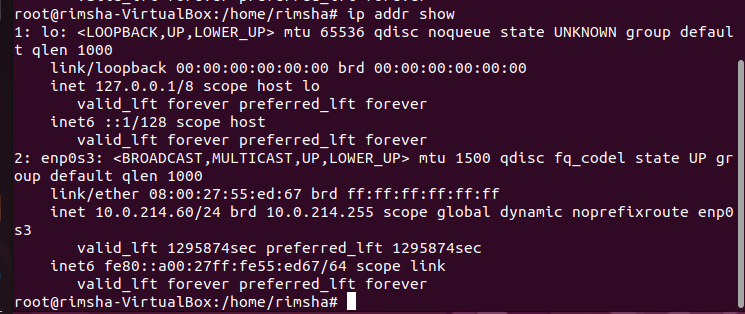

# Índice

- [Índice](#índice)
- [Práctica 2](#práctica-2)
    - [Autor: Rimsha](#autor-rimsha)
    - [Fecha: 10-10-2024](#fecha-10-10-2024)
  - [Instalación y configuración de un servidor DHCP en Debian](#instalación-y-configuración-de-un-servidor-dhcp-en-debian)
    - [Plan de trabajo](#plan-de-trabajo)
    - [**Configuración de pfSense**](#configuración-de-pfsense)
    - [**Configuración de Debian 12 DHCP Server**](#configuración-de-debian-12-dhcp-server)
    - [**Configuración de Ubuntu**](#configuración-de-ubuntu)
    - [**Configuraciones en Windows 10**](#configuraciones-en-windows-10)
    - [Ejercicio 1. Configuración del servidor DHCP](#ejercicio-1-configuración-del-servidor-dhcp)
    - [Respecto a los tiempos de alquiler:](#respecto-a-los-tiempos-de-alquiler)
    - [Ejercicio 2. Configuración de los clientes DHCP.](#ejercicio-2-configuración-de-los-clientes-dhcp)
    - [Ejercicio 3. Funcionamiento del servicio.](#ejercicio-3-funcionamiento-del-servicio)

# Práctica 2 
### Autor: Rimsha
### Fecha: 10-10-2024 

## Instalación y configuración de un servidor DHCP en Debian   

### Plan de trabajo
En esta práctica vamos a implementar una red de acuerdo con el siguiente diagrama:

  

Vamos a instalar y configurar un **servidor DHCP** en **Debian** con dos clientes, uno **Windows** y otro **Linux**.  

Las tres máquinas, el **servidor Debian**, el cliente con **Windows** y el **cliente Ubuntu**, estarán en la misma subred privada interna **SRI214**, con dirección de red **10.0.214.0/24**. Las máquinas estarán conectadas a Internet a través de un router **pfSense**.  

1. Configurar las máquinas indicadas en la topología de red que aparece en la imagen superior, asignar manualmente las direcciones IP indicadas a los dispositivos correspondientes, y cambiar los nombres de las computadoras como se indica en el diagrama.  

### **Configuración de pfSense**    
Vamos a la opción 2 para el cambio de IPs.  

  

Seleccionamos opción 2 para hacer cambios de LAN.  

  

Ponemos **n** porque no queremos configuraciones DHCP.  

  

Entramos nuestra IP: **10.0.214.1** para LAN interna.  

    

Elegimos la máscara de red **/24**.  

  

No queremos cambiar nada de WAN, así que pulsamos **ENTER**.  

    

No ponemos nada para IP de versión 6.  

  

No queremos DHCP, así que ponemos **n**.  

   

Ya está nuestra IP de LAN interna configurada.  

  

### **Configuración de Debian 12 DHCP Server**    
Con `nano`, abrimos el fichero de interfaces en el directorio `network`.  

    

Aquí ponemos **IP, Máscara de red, Puerta de enlace, Servidor DNS y nombre de DNS** que queremos poner a nuestro servidor Debian.  

   

Guardamos y reiniciamos los cambios.  

  

Comprobamos si los parámetros están configurados o no.  

    

Cambio de nombre en Debian.  

   

  

Comprobamos con `cat`.  

  

### **Configuración de Ubuntu**  
Iniciamos como admin para no tener que usar `sudo` antes de cada comando.  

  

Abrimos el fichero de configuración con `nano`.  

     

Captura antes de la configuración.  

    

Ponemos 3 líneas: 2 para el adaptador que vamos a usar y una para habilitar DHCP.  

    

Aplicamos los cambios.  

   

Comprobamos si los cambios están bien o no.  

   

Nombre de mi máquina.  

     

### **Configuraciones en Windows 10**   
Cambiamos el nombre de mi equipo.  

     

Y pongo mi nombre.  

  

Habilitamos servicios de DHCP en el cliente Windows.  

  

### Ejercicio 1. Configuración del servidor DHCP    
Instala el servidor DHCP en la máquina correspondiente.  
Actualizamos los paquetes.  

  

Instalamos el paquete del servidor DHCP.  

   

Vamos al directorio de DHCP.  

  

Listamos su contenido.  

  

  

  

Realizamos las configuraciones adicionales necesarias para que funcione el servidor DHCP.  
Vamos a abrir el archivo del servidor.  

  
    
Aquí ponemos nuestra interfaz de red que vamos a usar.  

Antes de cambios:   

  

Después de cambios:  

    

Realizamos las configuraciones necesarias para cumplir los siguientes requisitos:   

Antes de nada, realizamos un backup/copia del archivo original.  

      

Abrimos el fichero de configuración.  

   

Antes de configuración:  

    

El servidor repartirá direcciones IP en el rango **10.0.XX.1 – 10.0.XX.100**.  

  

Utilizamos la máscara por defecto correspondiente a esa subred.   

  

Ponemos como puerta de enlace la que corresponda según el diagrama de red.  

    

Como servidor DNS, ponemos el del instituto.  

  

Ponemos el sufijo DNS `sri214.local`.  
   

Para el cliente Ubuntu, se le reservará la dirección **10.0.214.60**.   

Antes de configuraciones:  
    

MAC de Ubuntu para confirmar que está en el mismo.  

  

Después de configuraciones:  

  

### Respecto a los tiempos de alquiler:  
El tiempo de alquiler por defecto será de **15 días** para todos los equipos. 

   

Nunca será superior a **30 días**.  

   

Nunca será inferior a **1 semana**. 

   

Cambios completos. 

   

Reiniciación del servicio y verificación de que tras el reinicio está activo y en ejecución.   

   

### Ejercicio 2. Configuración de los clientes DHCP. 
Configura los equipos Windows y Linux como clientes DHCP.   
Habilitamos el servicio DHCP.  

   

Vamos a renovar los parámetros. 
     
   

Los parámetros ya están cambiados correctamente.  

  

Observación dentro del archivo adecuado del servidor si las IPs han sido asignadas en Debian.  

 

* Observación dentro de ambos clientes que son correctos todos los parámetros enviados por el servidor.  
   1. IP 
   2. Máscara  
   3. Puerta de enlace   
   4. DNS 
   5. Nombre de dominio
   6. La MAC del equipo que tiene la reserva
  
En Windows:  

  

En Ubuntu:   
IP y Máscara:  
     

Puerta de enlace:  
   

DNS por defecto:    
  

Nombre de dominio:  
  

DNS por defecto:   
   

DNS después de cambiar:  
   

La MAC del equipo que tiene la reserva.  
  

Verificación de que existe conectividad entre los equipos y que además ambos equipos se conectan a Internet.  

  
  
 
   

### Ejercicio 3. Funcionamiento del servicio. 
Para terminar, deberás explicar la actividad generada por el servidor **isc-dhcp-server** que has instalado y configurado y que se ha registrado en los logs del sistema por la herramienta **journalctl**.  

  

* Aplica el tipo de filtro adecuado para que solo se muestre la actividad concreta relativa a la asignación de la configuración de tu cliente en un determinado intervalo de tiempo.  

  
